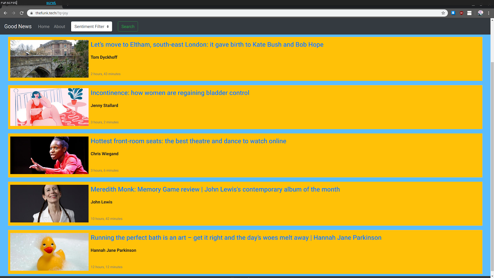

# Good News

## Stay Informed from a Different Perspective

Good News is a positive-news aggregation platform that attempts to address the subjective nature of "positivity" and "negativity". Currently the site scrapes articles from The Guardian and uses the IBM Tone Analyzer to tag each articles with sentiments. Our [index page](https://www.thefunk.tech/) shows all articles that have not been tagged with _fear_, _anger_, or _sadness_. By selecting from the dropdown menu in the navbar at the top of the page, you are able to filter content based on sentiment. For example, if you were to select the sentiment _joy_, then only articles tagged as expressing _joy_ will be displayed.



## Notable Features

- Dynamic filtering by sentiment
- No content mentioning COVID-19
- Content updated every 15 min.
- Secured with HTTPS

## What's Missing

So far we have done nothing to address the subjectivity surrounding what is *good*. We would like to address this in the following ways:

- investigate switching from IBM Tone Analyzer to an open source sentiment analysis tool in hopes of being able to fine tune models for our purposes
- Allow site users to make accounts. Users will be able to like and comment on articles. Likes will be used to customize user feed and hopefully show them the content they are most likely to enjoy. Comments will be run thru sentiment analysis in hopes of understanding how our users react to articles with specific tag combos.
- allow users to ban specific keywords or topics that may occur in articles so such articles do not appear in their feed.

### Long-Term Goals

We would like to separate our frontend from our backend by using our backend web framework as a REST api for our db. We believe that using a tool such as React for frontend rendering will help simplify our code base, create a better looking product, and accelerate feature development.

## How to Deploy

First off, you'll neeed to clone this repository:

```git clone https://github.com/benjamesian/GoodNews.git```

Request API keys from [IBM](https://www.ibm.com/cloud/watson-natural-language-understanding) and [The Guardian](https://open-platform.theguardian.com/access/), then contact one of the [authors](#authors) for details on how to proceed. Sorry, but it's the best we can do right now.

## How to Contribute

Feedback, ideas, contributions, questions, criticisms and conversations are always welcome. If the service described here seems valuable to you and you want to get involved, feel free to reach out to one of the [authors](#authors).

## Authors
- [Ben Cook](https://github.com/benjamesian/) - bencook400@gmail.com
- [Patrick DeYoreo](https://github.com/patrickdeyoreo/) - bencook400@gmail.com

## [License](LICENSE)

Distributed under the MIT License.

Copyright (c) 2020 Patrick DeYoreo & James Cook

## Related Works

- [How my attempt at building a news aggregation platform resulted in a COVID-19 filter for The Guardian.](https://medium.com/patricks-blog-for-holberton-school/good-news-everyone-cd6ab7387d6a)
